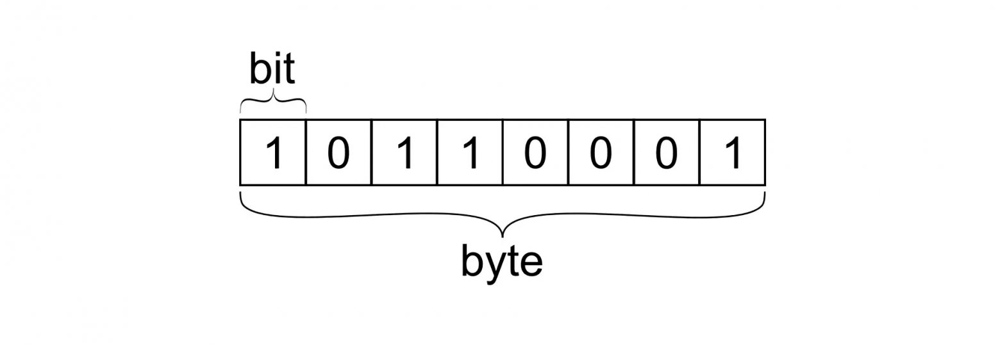
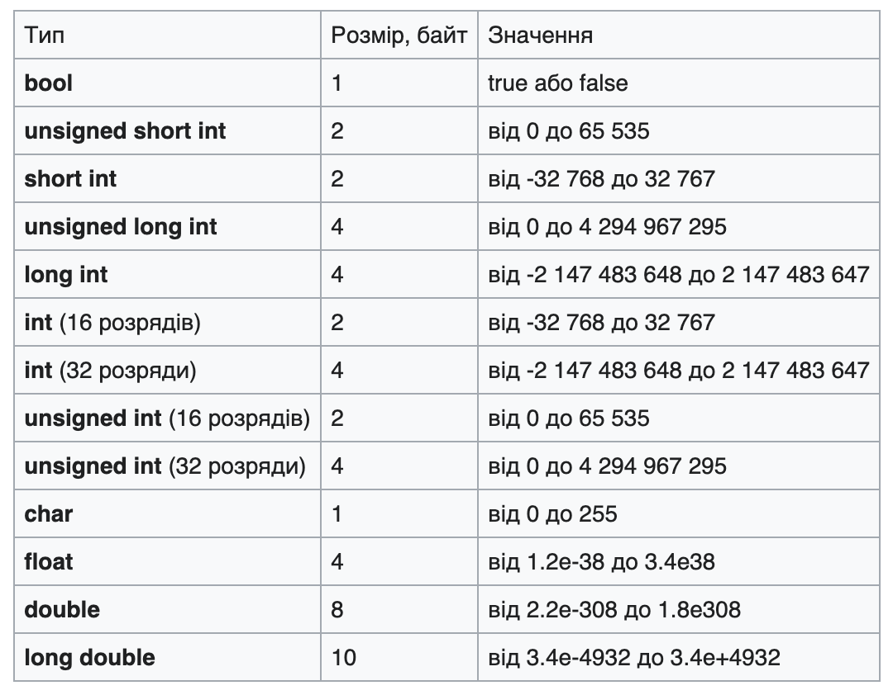

## Змінні

Ми живемо в світі де речі мають свої назви, а люди - імена. Звичне прохання
притримати двері було б великою проблемою якщо б українська не мала
слова "двері". Все навколо нас люди назвали і домовились розуміти за цими
назвами
конкретні речі. Ці правила природних мов працюють і в мовах програмування, базою
порозуміння вас і компʼютера є змінна - variable.

Щоб оголосити змінну в мові С треба три речі:

```c
int myFavoriteNumber = 22;
```

1. **Тип даних змінної** - в прикладі тип даних змінної це `int`, що означає
   integer, себто
   ціле число, наприклад 1, 2, 3, -1, 1234 і так далі. Ми часто стикаємось з
   такими змінними в житті, наприклад номер маршрутки або температура повітря за
   вікном частіше всього прості числа.
2. **Назва змінної** - в прикладі назва змінної це `myFavoriteNumber`, назви
   змінних можуть бути
   які завгодно, тут ми самі творці і даємо назви нашим дітищам, головне правило
   в справі називання змінних - змінна має відповідати своїй назві, щоб ви і
   інші люди розуміли що це за змінна. Це як називати власну дитину, ну якось
   погано буде звучати `qwerty1`. Звідси відома фраза змінних - Скажи мені як
   тебе звуть і я скажу хто ти.
3. **Початкове значення змінної** (Не обовʼязково) - змінні треба для того щоб
   мати
   якесь наповнення, тобто значення. Значення має відповідати типу даних і
   назві, в прикладі я призначаю змінній `myFavoriteNumber` типу `int` (просте
   число) значення `22`, що є простим числом.

Напишемо програму з такою змінною і виведемо значення цієї змінною в термінал (
якщо ви не знаєте як зкомпілювати і запустити таку програму - дивіться лекцію
1):

```c
#include <stdio.h>

int main() {
    int myFavouriteNumber = 22;

    printf("%d", myFavouriteNumber);
    return 0;
}
```

В результаті отримуємо у терміналі `22`, тепер підставте ваше улюблене число в
початкове значення змінної, збережіть файл з програмою і запустіть знову -
магія. Або не магія, в чому сенс цього? Сенс в тому як це взаємодіють змінні,
спойлер - доволі гарно.
Напишемо програму-калькулятор що буде додавати числа:

```c
#include <stdio.h>

int main() {
    int a = 2;
    int b = 2;

    int result = a + b;

    printf("%d", result);
    return 0;
}
```

В прикладі, я оголошую змінні `a` і `b` типу простих чисел і призначаю їм
початкове значення `2`. Далі я створюю змінну `result` типу простого числа і як
початкове значення змінної призначаю суму змінних `a` і `b`. Виводимо
значення змінної result в термінал і бачимо що там - `4`. (в росії вивело б `5`,
жартую, чи ні..) Тепер спробуйте
змінити значення змінних `a` і `b`, збережіть, запустіть. Зроблено? Тепер
поміняйте `+` на `-` в змінній `result`, запускайте.

Але як так сталось що програма розуміє що треба додавати на `+`, а віднімати
на `-`,
чому це працює? Які максимальні числа ми можемо записати в змінну?
Що робити якщо число не ціле, а, наприклад, `2.5`? А що ще крім чисел можна
використати? Відповіді є:

### Системи Числення

Як інформація, насамперед числа, виглядають для комʼютера?

Компʼютер оперує тільки двома числами - `1` та `0` записаними в певній кількості
і послідовності. Щоб зрозуміти краще, уявимо що памʼять компʼютера представлена
зошитом в клітинку, де ми можемо записувати тільки 1 або 0 в кожній клітинці,
така клітинка
називається [біт](https://uk.wikipedia.org/wiki/%D0%91%D1%96%D1%82). Біт -
найменша одиниця кількості інформації - "так", або "ні", "вкл" або "викл".



Давайте подумаємо як ми - люди (сподіваюсь ви люди там в
майбутньому), кожен день
працюємо з числами. В нас є цифри і є числа, цифрою ми
називаємо тільки символи від 0-9, все інше є числами (наприклад 101, або 42).
Числа ми складаємо з цифр. Тобто, ми кодуємо числа спеціальними знаками -
цифрами, а разом числа і цифри утворюють
[систему числення](https://uk.wikipedia.org/wiki/%D0%A1%D0%B8%D1%81%D1%82%D0%B5%D0%BC%D0%B0_%D1%87%D0%B8%D1%81%D0%BB%D0%B5%D0%BD%D0%BD%D1%8F).
Можемо змінити арабські символи 0-9 на римські або придумати свої закарючки і
придумати шифр - все буде працювати однаково.

10 базових символів, щоб зобразити все інше - доволі зручно, в нас якраз 10
пальців на руках, це зрозуміла і звична нам система числення - ми назвали
її [десяткова](https://uk.wikipedia.org/wiki/%D0%94%D0%B5%D1%81%D1%8F%D1%82%D0%BA%D0%BE%D0%B2%D0%B0_%D1%81%D0%B8%D1%81%D1%82%D0%B5%D0%BC%D0%B0_%D1%87%D0%B8%D1%81%D0%BB%D0%B5%D0%BD%D0%BD%D1%8F),
а що зручно для
компʼютера якому ми пишемо вказівки?

Система числення якою оперує
компʼютер - [двійкова](https://uk.wikipedia.org/wiki/%D0%94%D0%B2%D1%96%D0%B9%D0%BA%D0%BE%D0%B2%D0%B0_%D1%81%D0%B8%D1%81%D1%82%D0%B5%D0%BC%D0%B0_%D1%87%D0%B8%D1%81%D0%BB%D0%B5%D0%BD%D0%BD%D1%8F).
Тобто будь-яке число компʼютер записує використовуючи тільки 2 символи - 0 і 1.
Чому? Бо це зручно і практично, струм у транзисторі або є або нема - 1 або 0. Це
легко рахувати, компʼютери які так рахують легко будувати і підтримувати. Звідси
і виходить поняття біта.

Десяткове `5` дорівнює двійковому `101`, тобто щоб закодувати число 5 компʼютер
використовує аж 3 клітинки. Десяткове `100` є двійковим `1100100` - 7 клітинок.
А максимальне двійкове значення яке поміститься у 8 клітинок буде `11111111`,
тобто `255` в десятковій СЧ. Група у 8 комірок - є байтом, група у 8000 (8 *
10^3)
комірок - кілобайтом, група у 8 * 10^6 - мегабайтом і так далі. Вісім комірок
для байта обрали історично як двійку в степені 3.

Існують ще безліч інших систем числення, якими зручно оперувати під свої задачі,
найпопулярнішою після десяткової і двійкової
є [шістнадцяткова](https://uk.wikipedia.org/wiki/%D0%A8%D1%96%D1%81%D1%82%D0%BD%D0%B0%D0%B4%D1%86%D1%8F%D1%82%D0%BA%D0%BE%D0%B2%D0%B0_%D1%81%D0%B8%D1%81%D1%82%D0%B5%D0%BC%D0%B0_%D1%87%D0%B8%D1%81%D0%BB%D0%B5%D0%BD%D0%BD%D1%8F).
Там ми кодуємо все за допомогою аж 16 символів. (0-9 і A-F). Цією системою
числення, наприклад, закодовано багато кольорів, звідси і є hex кольору.

Вам варто піти в пошуковик і знайти "binary to decimal
converter", повводити звичні числа і подивитись як вони виглядають у двійковому
вигляді, те саме ви можете знайти для 16-ткових чисел, або навіть розібратись
самостійно як легко і швидко переводити однакові числа з одної системи
в іншу "на листочку".

### Типи Даних

В мові програмування С є такі основні типи даних, кожен з яких займає свою
кількість комірок:

1. int - ціле число;
2. char - [ASCII](https://uk.wikipedia.org/wiki/ASCII) символ;
3. bool - значення `true` aбо `false`;
4. float - число з плаваючою комою;
5. double - число з плаваючою комою з подвійною точністю;
6. void - відсутність значення.




