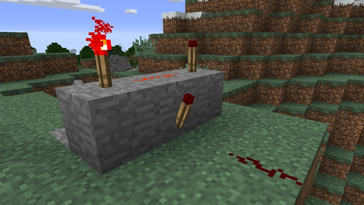
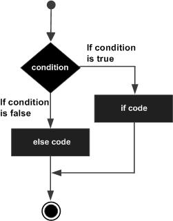

## Повнота за Тюрінгом

Чи задумувались ви колись про межі програми які можна створити? Чи можу я дійсно
написати абсолютно все, що захочу, будь-яку програму про будь-що? Чи тут є якісь
потенційні межі? Відповідь проста - якщо середовище (мова програмування, абощо)
повне за Тюрінгом то ми можемо створити будь-що.



На фото ви бачите логічний перемикач з комп'ютерної гри Minecraft зроблений за
допомогою redstone - такого собі ігрового замінника електричності. Redstone в
Minecraft є Тюрінг повним, тобто теоретично всередині гри можна створити
компʼютер будь-якої складності, більше того деякі
люди [саме цим і займаються](https://www.youtube.com/watch?v=FDiapbD0Xfg)!

Тож де лежать межі?

Щоб
називатись [повною за Тюрінгом](https://uk.wikipedia.org/wiki/%D0%9F%D0%BE%D0%B2%D0%BD%D0%BE%D1%82%D0%B0_%D0%B7%D0%B0_%D0%A2%D1%8E%D1%80%D1%96%D0%BD%D0%B3%D0%BE%D0%BC)
мові програмування або будь-чому іншому треба мати такі властивості:

1. Мати можливість створювати змінні і зберігати в них значення (працювати з
   памʼяттю)
2. Мати можливість писати умови (виконай це, а якщо ні, то оце)
3. Мати можливість повторювати шматок програми потрібну кількість разів (писати
   цикли
   або [рекурсію](https://uk.wikipedia.org/wiki/%D0%A0%D0%B5%D0%BA%D1%83%D1%80%D1%81%D1%96%D1%8F))

Одразу кажу що це моя інтерпретація Тюрінг повноти, дуже далека від правильного
і повного формулювання.

Щодо першого пункту ми вже знаємо як писати змінні і для чого вони треба, тепер
розберемо останні 2 фундаментальні властивості на прикладі мови С - а вона якраз
і є повною за Тюрінгом, іншими словами на С можна написати програму будь-якої
складності!

## [Умовний перехід](https://uk.wikipedia.org/wiki/%D0%A3%D0%BC%D0%BE%D0%B2%D0%BD%D0%B8%D0%B9_%D0%BF%D0%B5%D1%80%D0%B5%D1%85%D1%96%D0%B4)

```c
#include <stdio.h>
#include <stdbool.h>

int main() {
    bool isNight = false;

    if (isNight) {
        printf("Йдем спати\n");
    } else {
        printf("Йдем на роботу\n");
    }

    return 0;
}
```

Розберемо простеньку програму - я створив змінну `isNight` типу boolean і
ініціалізував її значення false, я передаю цю змінну в спеціальну конструкцію
if-else, яка напише `Йдем спати` якщо `isNight = true`, або,
якщо `isNight = false` напише `Йдем на роботу`. Такий собі сумненький приклад,
але дієвий!

Конструкція може складатись просто з `if` без `else`:

```c
 if (isNight) {
     printf("Йдем спати\n");
 }
```

Або ж, якщо в нас декілька умов ми можемо додати скільки завгодно ще if-else:

```c
#include <stdio.h>
#include <stdbool.h>

int main() {
   bool isNight = false;
   bool isMorning = false;
   
   if (isNight) {
      printf("Йдем спати\n");
   } else if (isMorning) {
      printf("Йдем на роботу\n");
   } else {
      printf("Йдем з роботи\n");
   }
   
   return 0;
}
```

Така собі умова, роби це, а якщо ні, то роби це. Пограйтесь з прикладом та
придумайте свій.



Ось так конструкція виглядає
на [блок схемі](https://uk.wikipedia.org/wiki/%D0%91%D0%BB%D0%BE%D0%BA-%D1%81%D1%85%D0%B5%D0%BC%D0%B0),
де ромб - умова (в центрі ромба пишеться яка саме, в нашому випадку ми б
написали
туди `isNight == true`), а прямокутники - інструкції що виконуються якщо умова
позитивна або негативна. Важливо розуміти блок схеми, бо вони є такою собі
міжнаціональною мовою програмістів.

Також в С-подібних мовах програмування є лайфхак, який ще
називають [тернарним оператором](https://uk.wikipedia.org/wiki/%D0%A2%D0%B5%D1%80%D0%BD%D0%B0%D1%80%D0%BD%D0%B0_%D1%83%D0%BC%D0%BE%D0%B2%D0%BD%D0%B0_%D0%BE%D0%BF%D0%B5%D1%80%D0%B0%D1%86%D1%96%D1%8F),
це спосіб записати конструкцію if-else в один рядок, виглядає це ось так:

`умова ? (виконати якщо так) : (виконати якщо ні)`

Ключовими тут є символи `?` і `:` які розділяють блоки що треба виконати
на `так` і на `ні`. Навіщо це потрібно? Просто щоб було красивіше в ситуаціях де
треба записати в умову в одному рядку і все. Наприклад, спростимо наш перший
приклад:

```c
#include <stdio.h>
#include <stdbool.h>

int main() {
    bool isNight = false;

    printf(isNight ? "Йдем спати\n" : "Йдем на роботу\n");
    
    return 0;
}
```

Стало менше і красивіше, але ВАЖЛИВИЙ МОМЕНТ - тернарні оператори перетворять
ваш код на пекло, якщо ви будете писати умови всередині інших умов! Беремо наш
другий приклад з `if-else-if`:

```c
#include <stdio.h>
#include <stdbool.h>

int main() {
   bool isNight = false;
   bool isMorning = false;
   
   printf(isNight ? "Йдем спати\n" : (isMorning ? "Йдем на роботу\n" : "Йдем з роботи\n"));
   
   return 0;
}
```

Як бачите, виглядає вже сумнівно, треба довго вчитуватись, щоб зрозуміти це, тож
уникайте тернарних операторів там де логіка складніше за одну умову!

## Цикл

Цикли будуть оточувати вас завжди, розуміння як воно працює в вашій уяві є
обовʼязковим для програміста. Що таке цикл в мові програмування? Це можливість
повторити якісь дії стільки разів, скільки нам треба. Уявіть що ви купили відро
черешні за знижкою, продавець сказав вам що вона червива і ви вирішили покласти
цьому край і написати програму-робота який буде автоматично відкривати черешню і
дивитись чи там є червʼяки:

```c
#include <stdio.h>
#include <stdbool.h>

int main() {
    bool cherry[5] = {false, false, false, false, true};

    if (cherry[0] == true) {
        printf("1ша Червива!");
    }

    if (cherry[1] == true) {
        printf("2га Червива!");
    }

    if (cherry[2] == true) {
        printf("3та Червива!");
    }

    if (cherry[3] == true) {
        printf("4рта Червива!");
    }

    if (cherry[4] == true) {
        printf("5та Червива!");
    }
}
```

Ви створюєте масив черешень `cherry` на 5 елементів типу bool, де якщо черешня
червива, то в масиві буде записано `true`, а якщо ні, то `false`. І пишете
умовні конструкції де перевіряєте всі черешні, тепер тільки підставляй відра і
дивись які по рахунку черешні червиві.

Проте, на 5 умові стає зрозуміло що писати таку програму буде занадто довго - ми
написали програму лише для 5 перших елементів і вона вже велика, що буде якщо у
відрі буде не 5, а 5000 черешень? А що якщо ми не знаємо заздалегідь скільки
буде черешень у відрі? Тут нам і треба цикли, а саме цикл з лічильником!
Перепишемо нашу програму з циклом:

```c
#include <stdio.h>
#include <stdbool.h>

int main() {
    bool cherry[5] = {false, false, false, false, true};

    for (int i = 0; i < 5; i++) {
        if (cherry[i] == true) {
            printf("%d - червива!", i + 1);
        }
    }
}
```

Ми прибрали купу умов і фактично сказали компʼютеру, що поки (`for`) змінна `i`
типу `int` з початковим значенням `i = 0` менше 5 - виконуй такі команди (**тіло
циклу**), при цьому на кожній **ітерації** збільшуй лічильник `i` на один. 
