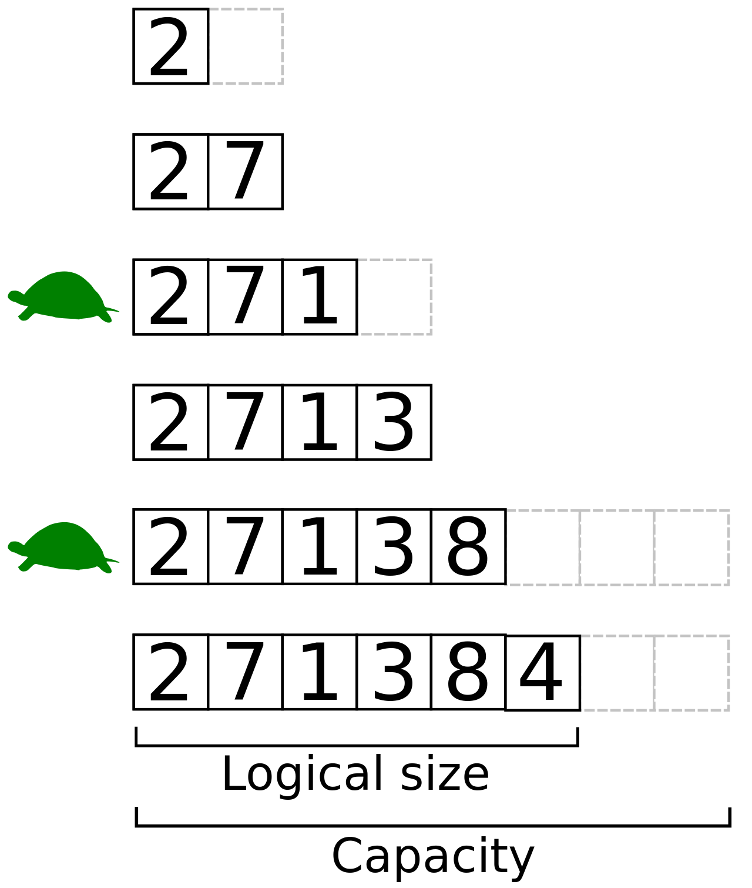

## Динамічний масив

Розмір масиву оголошується при його ініціалізації:

```c
    int numbers[5] = {1, 2, 3, 4, 5};
```

Компілятор мови С під час компіляції планує скільки памʼяті треба дати змінній,
щоб зберігати n значень вказаного типу даних [див. Памʼять].
Але що робити коли ми не знаємо заздалегідь розмір масиву? Логічно б
було "зарезервувати" стільки місця в масиві, щоб його
точно вистачило, наприклад 1000, або ... 10000?
Але якщо в нашій програмі певні сутності теоретично можуть
досягати значень у сотні тисяч елементів в масиві - що робити тоді? Виділяти
памʼяті масиву на тисячі елементів для малоймовірного сценарію? Чи поставити
обмеження користувачу?

Все це не є остаточним розв'язання проблеми, бо нам
треба - [динамічний масив](https://uk.wikipedia.org/wiki/%D0%94%D0%B8%D0%BD%D0%B0%D0%BC%D1%96%D1%87%D0%BD%D0%B8%D0%B9_%D0%BC%D0%B0%D1%81%D0%B8%D0%B2).
Тобто масив зі змінною довжиною, який буде збільшувати обʼєм займаної памʼяті
при додаванні в нього елементів.

Давайте подумаємо - як це має працювати? Уявляємо в голові алгоритм:

1. Створюємо динамічний масив, вказуємо початковий розмір масиву - наприклад 2
   комірки
2. Додаємо перший елемент в масив, при цьому розмір масиву не змінюється, тепер
   зайнято 1/2 комірок
3. Додаємо дргуий елемент в масив, при цьому розмір масиву не змінюється, тепер
   зайнято 2/2 комірок
4. Додаємо третій елемент в масив, перед цим збільшивши розмір масиву на 1
   комірку. А якщо процес виділення нових комірок складний і виділяти кожен раз
   одну додаткову комірку не оптимально? Тоді як вам ідея множити "місткість"
   масиву на 2 при зміні розміру масиву?
5. Повторюємо операцію безліч разів, доти, доки не вийдемо за обмеження що
   ставить програмі операційна система

Приклад з динамічним масивом цілих чисел:



1. Оголошуємо динамічний масив розміром 2, ініціалізуємо його значенням `2`.
   Зайнято 1/2 комірок памʼяті
2. Додаємо в кінець масиву значення `7`. Зайнято 2/2 комірок, наступне додавання
   елементів в масив має змінити його розмір
3. Додаємо в кінець масиву значення `1`, щоб помістилось, збільшимо місткість
   масиву (capacity) в 2 рази - 2 * 2 = 4 комірки. Зайнято 3/4 комірок
4. Додаємо в кінець масиву значення `3`. Зайнято 4/4 комірок, наступне додавання
   елементів в масив має змінити його розмір
5. Додаємо в кінець масиву значення `8`, щоб помістилось, збільшимо місткість
   масиву в 2 рази - 4 * 2 = 8 комірки. Зайнято 5/8 комірок

З останнього пункту прикладу варто відзначити, що розмір (size, length) масиву -
5 елементів, тобто скільки фактично він має в собі значень і місткість
(capacity) - 8 елементів, скільки масив може в себе вмістити до наступної зміни
розміру це різні речі і не можна їх плутати.

Не обовʼязково множити місткість комірок на 2 - як і на скільки змінювати
місткість масиву вирішувати вам, залежно від задачі яку ви вирішуєте, множення
на 2 є гарним прикладом.

### Реалізація

Ми вже зрозуміли, що динамічний масив певного типу даних має мати:

1. Місткість - capacity
2. Розмір - length / size

Але як нам динамічно виділяти комірки під значення певного типу даних?

Ми знаємо що мова С дозволяє динамічно резервувати памʼять на
купі [див. Памʼять], тобто ми можемо резервувати потрібний обʼєм памʼяті на купі
і отримувати посилання на початок цієї памʼяті [див. Посилання].
Маючи тип даних, місткість, кількість елементів і посилання на початок памʼяті
ми можемо зробити все.
Capacity, length і тип даних в нас вже є, чого не вистачає:

3. Значень масиву - items

Щоб якось упорядкувати 3 змінні створимо структуру [див. Структури] динамічного
масиву, що зберігає цілі числа:

```c
struct DynArray
{
    size_t capacity; // місткість масиву
    size_t length; // кільксть елементів в масиві
    int *items; // поислання на значення елементів
};
```

Тепер ми можемо оголосити динамічний масив:

```
#include <stdio.h>

struct DynArray
{
    size_t capacity; // місткість масиву
    size_t length; // кільксть елементів в масиві
    int *items; // поислання на значення елементів
};

int main() {
   struct DynArray arr;
   
   return 0;
}
```

Ми не зможемо їм користуватись, бо поля структури не ініціалізовані,
ініціалізуємо їх з початковою місткістю, наприклад 2:

```c
#include <stdio.h>
#include <stdlib.h>

struct DynArray
{
    size_t capacity; // місткість масиву
    size_t length; // кількість елементів в масиві
    int *items; // посилання на значення елементів
};

int main() {
   struct DynArray arr;
 
   arr.capacity = 2;
   arr.length = 0;
   arr.items = malloc(arr.capacity * sizeof(int));
   
   free(arr.items);  // не забуваємо звільнити зарезервовану памʼять
   return 0;
}
```

Супер, але кожен раз, коли нам треба динамічний масив, писати 3 рядки
ініціалізації доволі
довго, пропоную зробити функцію `initDynamicArray`, яка буде ініціалізувати поля
динамічного масиву та водночас приховувати деталі реалізації динамічного масиву,
які не треба нам як користувачу:

```c
void initDynamicArray(struct DynArray *arr, size_t capacity)
{
    arr->capacity = capacity;
    arr->length = 0;
    arr->items = malloc(arr->capacity * sizeof(int));
}
```

Функція приймає посилання на динамічний масив та початкову місткість - все що
треба знати клієнтському коду, далі функція мутує структуру і ми можемо
використати її далі в коді:

```c
#include <stdio.h>
#include <stdlib.h>

struct DynArray
{
    size_t capacity; // місткість масиву
    size_t length; // кількість елементів в масиві
    int *items; // посилання на значення елементів
};

void initDynamicArray(struct DynArray *arr, size_t capacity)
{
    arr->capacity = capacity;
    arr->length = 0;
    arr->items = malloc(arr->capacity * sizeof(int));
}

int main() {
   struct DynArray arr;
 
   initDynamicArray(&arr, 2);
   
   free(arr.items);  // не забуваємо звільнити зарезервовану памʼять
   return 0;
}
```

Хорошим тоном буде додати ще функцію `destroyDynamicArray` для знищення
динамічного масиву, щоб
приховати від клієнтського коду непотрібні деталі:

```c
void destroyDynamicArray(struct DynArray *arr)
{
    if (arr->items != NULL)
    {
        free(arr->items);
    }

    arr->items = NULL;
    arr->capacity = 0;
    arr->length = 0;
}
```

А також час вже додати елементи в масив, для цього зробимо
функцію `pushToDynamicArray` та функцію `printDynamicArray` для того щоб
подивитись як виглядає наш динамічний масив:

```c
void pushToDynamicArray(struct DynArray *arr, int item)
{
    arr->items[arr->length] = item;
    arr->length++;
}

void printDynamicArray(struct DynArray *arr)
{
    printf("%zu / %zu\n", arr->length, arr->capacity);

    printf("[");
    for (int i = 0; i < arr->length; i++)
    {
        printf("%i", arr->items[i]);

        if (i < arr->length - 1) {
            printf(", ");
        }
    }
    printf("]\n\n");
}
```

І, в нас вже є ще написати і подивитись:

```c
#include <stdio.h>
#include <stdlib.h>

struct DynArray
{
    size_t capacity; // місткість масиву
    size_t length; // кількість елементів в масиві
    int *items; // посилання на значення елементів
};

void initDynamicArray(struct DynArray *arr, size_t capacity)
{
    arr->capacity = capacity;
    arr->length = 0;
    arr->items = malloc(arr->capacity * sizeof(int));
}

void destroyDynamicArray(struct DynArray *arr)
{
    if (arr->items != NULL)
    {
        free(arr->items);
    }

    arr->items = NULL;
    arr->capacity = 0;
    arr->length = 0;
}

void pushToDynamicArray(struct DynArray *arr, int item)
{
    arr->items[arr->length] = item;
    arr->length++;
}

void printDynamicArray(struct DynArray *arr)
{
    printf("%zu / %zu\n", arr->length, arr->capacity);

    printf("[");
    for (int i = 0; i < arr->length; i++)
    {
        printf("%i", arr->items[i]);

        if (i < arr->length - 1) {
            printf(", ");
        }
    }
    printf("]\n\n");
}

int main() {
   struct DynArray arr;
   initDynamicArray(&arr, 2);
   
   pushToDynamicArray(&arr, 10);
   printDynamicArray(&arr);
   
   pushToDynamicArray(&arr, 20);
   printDynamicArray(&arr);
   
   destroyDynamicArray(&arr);
   return 0;
}
```

В прикладі я ініціалізую динамічний масив на 2 комірки і заповнюю їх
значеннями `10` і `20`, кожен раз виводячи вміст динамічного масиву в консоль:

```bash 
1 / 2
[10]

2 / 2
[10, 20]
```

Ми бачимо що масив заповнюється і вкінці кількість елементів масиву - його
довжина дорівнює місткості, що ж буде зараз якщо ми додамо 3 елемент? В теорії,
місткість масиву має збільшитись, щоб помістити новий елемент, пробуємо:

```c
int main() {
   struct DynArray arr;
   initDynamicArray(&arr, 2);
   
   pushToDynamicArray(&arr, 10);
   pushToDynamicArray(&arr, 20);
   pushToDynamicArray(&arr, 30);
   printDynamicArray(&arr);
   
   destroyDynamicArray(&arr);
   return 0;
}
```

... і отримуємо різний результат, оскільки ми ще не написали функціонал зміни
місткості масиву, тобто зараз наша програма спробує записати нове, третє
значення в область памʼяті яка не належить нашій програмі, результат завжди
різний, починаючи від того що все спрацює:

```bash
3 / 2
[10, 20, 30]
```

.. закінчуючи фатальною помилкою нашої програми. Більше детально чому так і чому
варто уникати цього варто
прочитати [тут](https://stackoverflow.com/questions/9901366/try-to-buffer-overflow-value-allocated-by-malloc).
Реалізуймо нарешті головну функцію динамічного масиву - зміну його місткості й
назвемо її `resizeDynamicArray`, а також модифікуємо
функцію `pushToDynamicArray` щоб вона збільшувала місткість масиву за потреби:

```c
void resizeDynamicArray(struct DynArray *arr, size_t newCapacity)
{
    if (newCapacity > arr->capacity)
    {
        int *newItems = realloc(arr->items, newCapacity * sizeof(int));

        if (newItems == NULL)
        {
            fprintf(stderr, "Dynamic array memory reallocation error for %s", __func__);
        }

        arr->capacity = newCapacity;
        arr->items = newItems;
    }
}

void pushToDynamicArray(struct DynArray *arr, int item)
{
    if (arr->capacity == 0)
        resizeDynamicArray(arr, 1);

    if (arr->length == arr->capacity)
        resizeDynamicArray(arr, arr->capacity * 2);

    arr->items[arr->length] = item;
    arr->length++;
}
```

Пробуємо все разом:

```c
#include <stdio.h>
#include <stdlib.h>

struct DynArray
{
    size_t capacity; // місткість масиву
    size_t length; // кількість елементів в масиві
    int *items; // посилання на значення елементів
};

void initDynamicArray(struct DynArray *arr, size_t capacity)
{
    arr->capacity = capacity;
    arr->length = 0;
    arr->items = malloc(arr->capacity * sizeof(int));
}

void destroyDynamicArray(struct DynArray *arr)
{
    if (arr->items != NULL)
    {
        free(arr->items);
    }

    arr->items = NULL;
    arr->capacity = 0;
    arr->length = 0;
}

void resizeDynamicArray(struct DynArray *arr, size_t newCapacity)
{
    if (newCapacity > arr->capacity)
    {
        int *newItems = realloc(arr->items, newCapacity * sizeof(int));

        if (newItems == NULL)
        {
            fprintf(stderr, "Dynamic array memory reallocation error for %s", __func__);
        }

        arr->capacity = newCapacity;
        arr->items = newItems;
    }
}

void pushToDynamicArray(struct DynArray *arr, int item)
{
    if (arr->capacity == 0)
        resizeDynamicArray(arr, 1);

    if (arr->length == arr->capacity)
        resizeDynamicArray(arr, arr->capacity * 2);

    arr->items[arr->length] = item;
    arr->length++;
}

void printDynamicArray(struct DynArray *arr)
{
    printf("%zu / %zu\n", arr->length, arr->capacity);

    printf("[");
    for (int i = 0; i < arr->length; i++)
    {
        printf("%i", arr->items[i]);

        if (i < arr->length - 1) {
            printf(", ");
        }
    }
    printf("]\n\n");
}

int main() {
    struct DynArray arr;
    initDynamicArray(&arr, 2);

    pushToDynamicArray(&arr, 10);
    pushToDynamicArray(&arr, 20);
    printDynamicArray(&arr);

    pushToDynamicArray(&arr, 30);
    printDynamicArray(&arr);

    pushToDynamicArray(&arr, 40);
    pushToDynamicArray(&arr, 50);
    printDynamicArray(&arr);

   destroyDynamicArray(&arr);
   return 0;
}
```

і отримуємо:

```bash
2 / 2
[10, 20]

3 / 4
[10, 20, 30]

5 / 8
[10, 20, 30, 40, 50]
```

Вітаю ми зробили динамічний масив, тепер пропоную вам самостійно погратись і
реалізувати додаткові функції:

1. removeFromDynamicArray - видалення елементу масиву на вказаному індексі
2. popFromDynamicArray - видалення останнього елементу масиву, і повернення його
   як результат функції
3. emptyDynamicArray - видалення всіх елементів масиву

.. та інші які ви придумаєте самі, щоб Вам було зручно працювати з Вашим динамічним масивом =)
